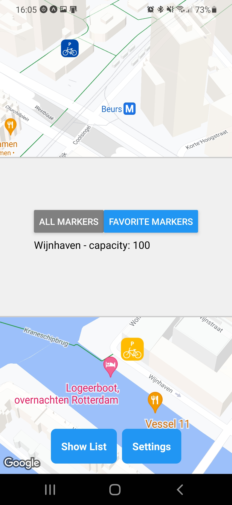

# ParkBike

**ParkBike** is a mobile application built with React Native and Expo, designed to help users find nearby bike parking spots. This app utilizes location services to display a map with various bike parking locations, allowing users to explore and interact with the available spots.



## Features

- **Interactive Map**: View bike parking spots on an interactive map.
- **Location Services**: Utilize your device's location for accurate spot identification.
- **Favorites**: Save your favorite parking spots for easy access.
- **Customizable**: Toggle dark mode, filter spot markers, and choose your preferred language (English, Dutch & German).
- **Settings**: Configure app settings to suit your preferences.

# Quick start
Follow the steps below to get started.
## Navigate to project directory
```
cd .\ParkBike\
```
## Install dependencies
Installs all packages the app depends on.
```
npm install
```
## Run app - Option #1
Run app on your device via Expo by scanning a QR code.
```
npx expo start
```
## Run app - Option #2
Run app via Android Studio's Emulator.
```
npm run android
```